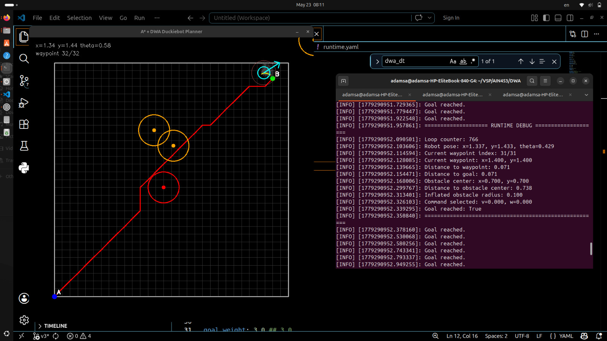

# 🚗 Dynamic Window Approach (DWA) Local Navigation

This project implements a Dynamic Window Approach (DWA) local planner for autonomous obstacle avoidance and motion control in a differential-drive robot.

The system combines global path planning with real-time local trajectory optimization. A global path is first generated using A* search on an occupancy grid, while DWA continuously evaluates candidate velocity commands to safely guide the robot toward the goal while avoiding nearby obstacles.

At each control cycle, the robot samples multiple linear and angular velocity combinations and predicts their future trajectories over a finite planning horizon. Each candidate trajectory is evaluated according to several criteria including:

- distance to the goal
- proximity to the global A* path
- waypoint tracking accuracy
- heading alignment
- obstacle clearance
- forward motion preference

The planner supports both known static obstacles and dynamically detected obstacles using onboard Time-of-Flight sensing. Newly detected obstacles are transformed into the world frame and integrated into the navigation process in real time, allowing the robot to react to unexpected environmental changes.

If no safe forward trajectory exists, the system executes a recovery behavior by temporarily reversing and steering away from the obstacle until a valid path becomes available again.

The project includes a live visualization interface displaying:

- occupancy grid
- global A* path
- static and dynamic obstacles
- sampled DWA trajectories
- selected optimal trajectory
- robot pose and heading
- navigation progress

The resulting system demonstrates how global planning and local reactive navigation can be combined to achieve robust autonomous motion under uncertainty and dynamic conditions.