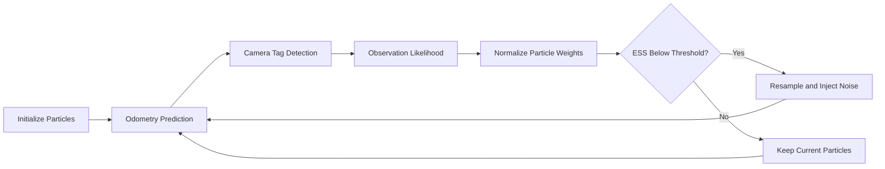

# 🎯 Monte Carlo Localization

<p align="center">
  <strong>Particle-filter localization in environments with repeated and visually ambiguous landmarks.</strong>
</p>

<p align="center">
  
</p>

<p align="center">
  <em>Particles gradually converge around the robot pose as odometry and repeated landmark observations are processed.</em>
</p>

<p align="center">
  ▶️ <a href="https://youtu.be/JwtKWX4133w"><strong>Watch the Monte Carlo Localization Demo on YouTube</strong></a>
</p>

<p align="center">
  📄 <a href="../Visuals/monteCarloImplementation.pdf"><strong>View the Implementation Details Presentation</strong></a>
</p>


---

## Overview

This project implements **Monte Carlo Localization (MCL)** using a particle filter to estimate a robot's pose in an environment containing repeated visual landmarks.

The environment may contain visually identical AprilTags or ArUco markers. Because a single camera observation can match more than one possible landmark location, the robot cannot always determine its position immediately.

Instead of committing to one estimate too early, the filter maintains a distribution of particles across the map. Each particle represents a possible robot-pose hypothesis. As the robot moves and receives new observations, inconsistent hypotheses become less likely while the particles gradually converge around the correct region.

---

## How It Works

### 1. Initialize particles

Particles are initially spread across the map. Each particle represents one possible robot pose:

```text
(x, y, θ)
```

This allows the filter to track multiple possible locations and orientations at the same time.

### 2. Predict motion from odometry

Whenever wheel-encoder odometry is received, every particle is moved using the differential-drive motion model.

Small motion noise is added during prediction so that the particles represent uncertainty rather than following identical paths.

### 3. Compare tag observations

When the camera detects a tag, the filter compares the real camera measurement with the observation that each particle would expect to see.

Because the map intentionally contains repeated landmarks, the filter evaluates multiple possible landmark correspondences instead of assuming that one observation has only one possible source.

### 4. Update particle weights

Particles receive higher weights when their expected observations agree more closely with the measured distance, bearing, and orientation.

These comparisons are combined into a single likelihood score that represents how well each particle explains the camera measurement.

### 5. Resample when necessary

The filter monitors the Effective Sample Size (`ESS`) to determine whether too much probability mass has concentrated in a small number of particles.

When resampling is triggered, stronger hypotheses are duplicated while weak hypotheses disappear. Small Gaussian perturbations are then injected to preserve diversity and reduce the risk of particle collapse.

---

## Workflow



Odometry continuously propagates the belief, while tag measurements periodically correct it.

---

## Observation Model

For every particle, the filter predicts what the detected tag should look like from that hypothetical robot pose.

Each observation is evaluated using three comparisons:

- **Distance error** — how close the predicted tag distance is to the measured distance
- **Bearing error** — how closely the predicted direction matches the camera observation
- **Orientation / yaw error** — how well the predicted relative orientation agrees with the measured orientation

Smaller errors produce higher likelihoods. The individual likelihoods are combined into one particle weight:

```text
particle weight = distance likelihood × bearing likelihood × orientation likelihood
```

Since several landmarks may look identical, the filter considers the possible matching landmark locations rather than assuming that the observed tag identity uniquely determines the robot pose.

---

## Adaptive Resampling

The filter does not resample blindly after every update. Instead, it monitors the Effective Sample Size (`ESS`) to estimate whether the current weight distribution is still healthy.

A low `ESS` indicates that only a small number of particles carry meaningful probability. When this happens, resampling duplicates stronger hypotheses and removes weaker ones.

Small Gaussian perturbations are added after resampling to preserve diversity. This helps the filter avoid overconfidence and makes it easier to recover from incorrect early assumptions.

---

## System Behavior

A typical localization sequence looks like this:

- At startup, particles are spread widely across the map.
- After odometry updates, each hypothesis moves according to the robot motion.
- The first ambiguous tag observation may still leave multiple plausible clusters.
- Additional movement and tag observations gradually eliminate inconsistent hypotheses.
- The surviving particles converge around the robot's estimated pose.

---

## Features

- ✅ Differential-drive motion prediction
- ✅ Wheel-encoder odometry integration
- ✅ Visual landmark measurement updates
- ✅ Distance, bearing, and orientation likelihoods
- ✅ Support for ambiguous repeated landmarks
- ✅ Particle-weight normalization
- ✅ Effective Sample Size (`ESS`) evaluation
- ✅ Adaptive probabilistic resampling
- ✅ Gaussian noise injection for particle diversity
- ✅ Real-time particle visualization

---

## Why This Project Matters

This project demonstrates why probabilistic localization is useful when sensors are noisy and visual landmarks are not uniquely identifiable. Instead of immediately committing to a single answer, the robot maintains competing pose hypotheses and allows evidence to accumulate over time. As new motion and camera measurements arrive, the particle filter gradually identifies the most consistent estimate of the robot's location.